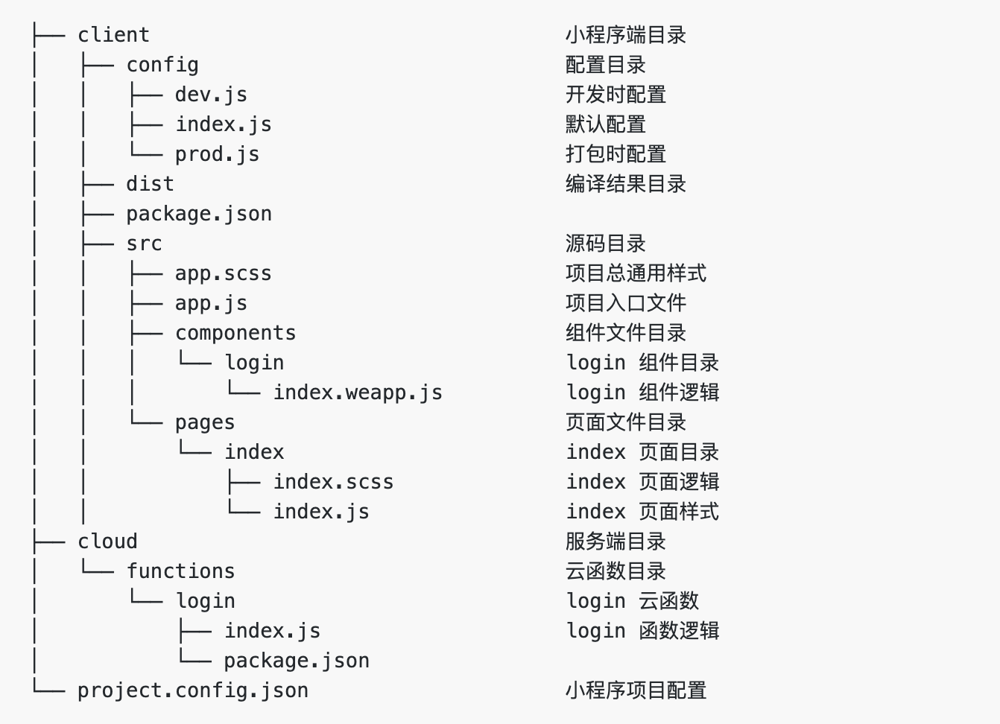

## 开始
### CLI 工具安装
> 首先，你需要使用 npm 或者 yarn 全局安装@tarojs/cli，或者直接使用npx:
```js
# 使用 npm 安装 CLI
$ npm install -g @tarojs/cli
# OR 使用 yarn 安装 CLI
$ yarn global add @tarojs/cli
# OR 安装了 cnpm，使用 cnpm 安装 CLI
$ cnpm install -g @tarojs/cli
```
### 项目初始化
- 使用命令创建模板项目
> taro init taro-timer
- 按提示进行相应的选择(微信云开发可直接选择`wxcloud`模板)


- 模板目录


#### 注意：
- 开发时，进入 client 目录，在此目录下运行相关编译预览或打包命令

- 使用微信开发者工具调试项目，请将项目 整个文件夹 作为运行目录。 注意： 不是 client 中生成的 dist 文件夹

## 云开发

未完待续

## 参考
1. [Taro官方文档](https://taro-docs.jd.com/taro/docs/README.html)
2. [Taro-ui官方文档](https://taro-ui.jd.com/#/docs/introduction)
3. [微信小程序开发相关文档](https://developers.weixin.qq.com/minigame/dev/wxcloud/basis/getting-started.html)